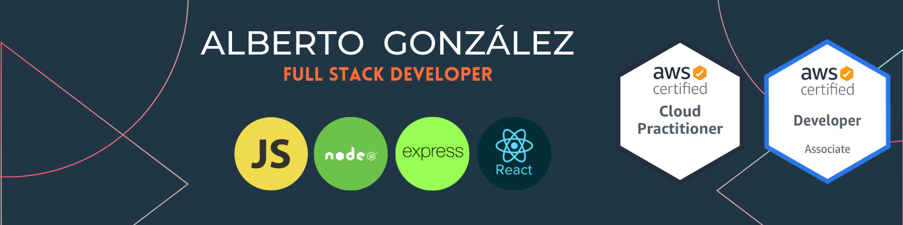

### Hi there!!! 😄
## JavaScript Full stack developer 🌐 ׀ AWS Certified Developer ☁️

👋🏻 I'm a software developer solving problems for 8 years, seeking to create maintainable and scalable solutions by implementing good practices. And I'm a lover of keyboard shortcuts too ❤️⌨️. 

👔 I've professional experience with: C #, WPF, Java, Spring, React js, Node js, Fastify, Cucumber, SQL Server, MySQL, PostgreSQL and AWS: Lambdas, Cognito, API Gateway and Step functions.

💼 I've developed personal projects with: Angular, GraphQL, Bootstrap, React Native, TypeScript, Mongo DB, and Serverless framework.

📚 I've knowledge in: Docker, Travis, Git, GitHub, ASP.Net, AWS EC2, VPN, S3, DynamoDB, CloudFormation.

☁️ AWS Certified Developer Associate and AWS enthusiast.

📖 I'm interested in DevOps, IoT, machine learning, artificial intelligence and data science.

<!--
**gbeto21/gbeto21** is a ✨ _special_ ✨ repository because its `README.md` (this file) appears on your GitHub profile.

Here are some ideas to get you started:

- 🔭 I’m currently working on ...
- 🌱 I’m currently learning ...
- 👯 I’m looking to collaborate on ...
- 🤔 I’m looking for help with ...
- 💬 Ask me about ...
- 📫 How to reach me: ...
- 😄 Pronouns: ...
- ⚡ Fun fact: ...
-->
